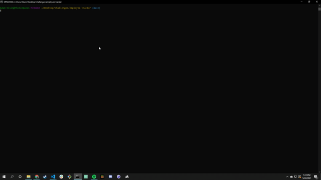

  # Employee Tracker

  ## Video Demonstration
  Click [HERE](https://drive.google.com/file/d/1uzXy9Bia9lku64ncFGQQoF4UK5ghgCbu/view) to watch the application being used live
  
  

  ## Description
  
  A node application that uses mysql to track and edit a database of departments, roles, and employees

  ## Table of Contents
  
  * [Installation](#installation)
  * [Usage](#usage)
  * [Contributing](#contributing)
  * [Tests](#tests)
  * [Questions](#questions)
  
  ## Installation
  
  In addition to `node` there is a required `npm i inquirer mysql2 console.table` as well

  ## Usage
  
  Mostly a demonstration of skills in using mysql database capabilities. There is some usage of inquirer as well, but mostly to gather user input. With this application, the user can view one of three tables in a database, the `department`, `role`, and `employee` ones to be exact. Viewing the tables of `role` and `employee` also use some `JOIN` statements to include extra data not in the base tables. In addition to simple viewing, ther e is also the ability to create new datasets for each table as well. Finally, there is also a simple update function that allows the user to change the role of a single employee.

  ## Contributing
  
  No Contributors at this time

  ## Tests
  
  No tests at this time

  ## Questions
  
  Reach out to me at the links below with any questions, comments, or concerns:

  GitHub: [adamlsn](https://github.com/adamlsn) 
  email: [adamlsn@gmail.com](mailto:adamlsn@gmail.com)
  